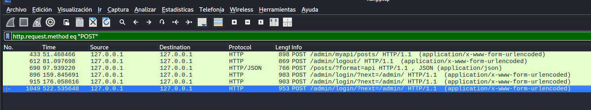
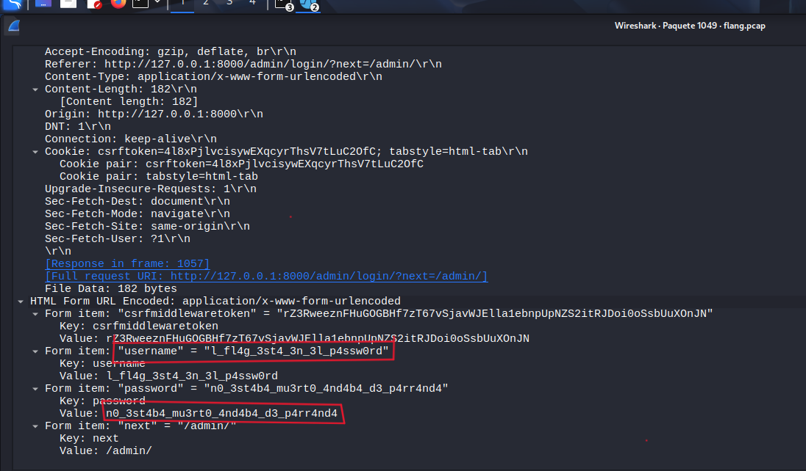
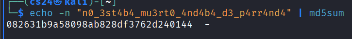

# Write-Up: El tesoro del muerto!!!

## Información General

**Nombre del reto:** El tesoro del muerto!!!  
**Categoría:** Forense de Red (Network Forensics)  
**Herramienta principal:** Wireshark  
**Archivo proporcionado:** `flang.pcap`

---

# 1. Descripción del reto

El reto proporcionaba un archivo de captura de tráfico de red en formato PCAP acompañado de la siguiente descripción:

> "Se fue capturando mapas para encontrar el tesoro nadie lo encontró hasta ahora será que tú eres el afortunado??? Encuéntralo antes que alguien más lo haga."

Debido a que el archivo entregado era una captura de paquetes de red, el objetivo consistía en analizar las comunicaciones registradas para identificar información oculta que permitiera recuperar la bandera del desafío.

---

# 2. Reconocimiento Inicial

Como primer paso se verificó el tipo de archivo entregado:

```bash
file flang.pcap
```

Resultado:

```text
flang.pcap: pcap capture file
```

Esto confirmó que se trataba de una captura de tráfico de red compatible con herramientas de análisis como Wireshark.

Posteriormente se abrió el archivo utilizando:

```bash
wireshark flang.pcap
```

---

# 3. Análisis del Tráfico

Una vez cargada la captura en Wireshark se observó una gran cantidad de tráfico HTTP.

Debido a que las credenciales suelen transmitirse mediante solicitudes POST, se aplicó el siguiente filtro:

```text
http.request.method == "POST"
```

El filtro permitió visualizar únicamente las solicitudes HTTP que enviaban información al servidor.



Entre los resultados encontrados destacaban varias peticiones relacionadas con autenticación:

```text
POST /admin/login/?next=/admin/
POST /admin/logout/
POST /posts/?format=json
POST /admin/mypapi/posts/
```

Las solicitudes dirigidas al panel administrativo resultaron especialmente interesantes debido a que normalmente contienen credenciales de acceso.

---

# 4. Inspección de las Solicitudes de Login

Se procedió a revisar cada una de las solicitudes:

```text
POST /admin/login/?next=/admin/
```

Los paquetes **896** y **915** contenían intentos de autenticación sin información relevante para la resolución del reto.

Sin embargo, al analizar el paquete **1049** y expandir la sección:

```text
HTML Form URL Encoded
```

se encontraron los siguientes parámetros:

```text
username=l_fl4g_3st4_3n_3l_p4ssw0rd
password=n0_3st4b4_mu3rt0_4nd4b4_d3_p4rr4nd4
```

La siguiente captura muestra las credenciales encontradas dentro del paquete 1049:



---

# 5. Interpretación de la Evidencia

Al interpretar los valores encontrados se observó que el nombre de usuario estaba escrito utilizando sustitución de caracteres:

```text
l_fl4g_3st4_3n_3l_p4ssw0rd
```

Equivalente a:

```text
la_flag_esta_en_el_password
```

Esta frase constituye una pista explícita que indica dónde se encuentra la bandera.

Por lo tanto, la atención se centró en el valor almacenado en el campo contraseña:

```text
n0_3st4b4_mu3rt0_4nd4b4_d3_p4rr4nd4
```

Interpretado como:

```text
no_estaba_muerto_andaba_de_parranda
```

---

# 6. Obtención de la Flag

Siguiendo la pista proporcionada por el nombre de usuario, se determinó que el contenido del campo contraseña correspondía al texto base de la bandera.

El reto requería entregar la respuesta en formato MD5.

Para generar el hash se ejecutó:

```bash
echo -n "n0_3st4b4_mu3rt0_4nd4b4_d3_p4rr4nd4" | md5sum
```

Resultado:

```text
082631b9a58098ab828df3762d240144
```

La siguiente captura muestra la generación del hash MD5:



Finalmente se construyó la bandera utilizando el formato solicitado:

```text
cidsi{082631b9a58098ab828df3762d240144}
```

---

# 7. Flag

```text
cidsi{082631b9a58098ab828df3762d240144}
```

---

# 8. Conclusiones

Durante el desarrollo del reto se aplicaron técnicas básicas de análisis forense de red utilizando Wireshark.

El procedimiento consistió en identificar tráfico HTTP relevante, filtrar solicitudes POST relacionadas con autenticación y examinar el contenido de los formularios transmitidos sin cifrado.

La captura permitió recuperar credenciales de acceso directamente desde el tráfico de red. El propio nombre de usuario contenía una pista que indicaba que la bandera se encontraba en el valor de la contraseña. Posteriormente se calculó el hash MD5 correspondiente para obtener la bandera final.

Este desafío demuestra la importancia de utilizar protocolos seguros como HTTPS, ya que la transmisión de credenciales mediante HTTP permite que cualquier observador del tráfico pueda recuperar información sensible de forma sencilla.

---

# Herramientas Utilizadas

- Kali Linux
    
- Wireshark
    
- md5sum
    

---

# Conceptos Aprendidos

- Análisis forense de tráfico de red.
    
- Interpretación de archivos PCAP.
    
- Uso de filtros HTTP en Wireshark.
    
- Recuperación de credenciales transmitidas sin cifrado.
    
- Generación de hashes MD5.
    
- Identificación de evidencia digital en protocolos de aplicación.
